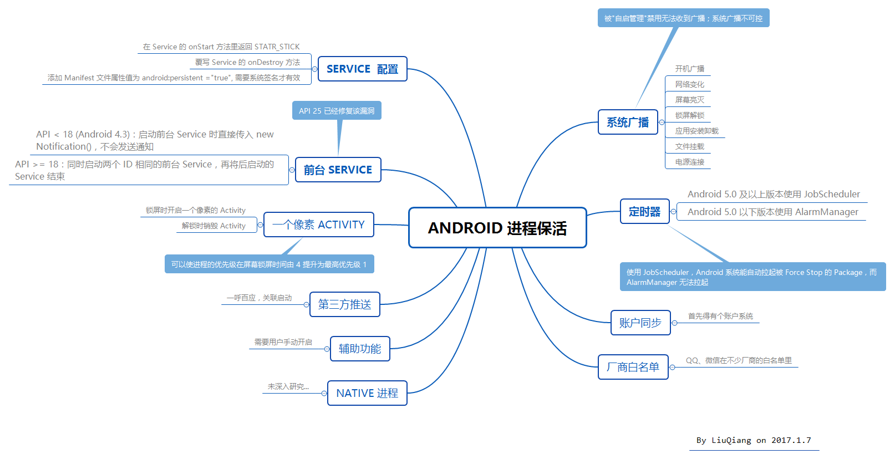

## AndroidKeepLivePractice

#### Android 进程保活简单实践

###### 相关介绍：
* [Android 进程保活系列：（一）利用 Activity 提升权限](http://www.jianshu.com/p/4ff700faab78)
* [Android 进程保活系列：（二）利用 Notification 提升权限](http://www.jianshu.com/p/8853f37f5869)
* [Android 进程保活系列：（三）利用定时器和系统广播](http://www.jianshu.com/p/adbfea66e3ae)

